# Order Drops
Brandt Cowan  
`r format(Sys.time(), '%B %d, %Y')`  
#Summary
To understand how changes to order drops induced by E-Commerce business, this analysis seeks to break down potential drivers and trends, and provide insight for future changes. 

#Data 
##Packages used

```r
library(readr)    #importing data
library(readxl)   #importing data
library(dplyr)    #data wrangling
library(tidyr)    #data tidying
library(lubridate)#data formatting for dates
library(forcats)  #data formatting for factors
library(psych)    #for use of the describeBy() function
library(ggplot2)  #data visualization
library(ggthemes) #for use of the fivethirtyeight theme
library(viridis)  #for use of the viridis color scheme
library(plotly)   #for use to create interactive html plots
```
This analysis will work within the tidyverse, almost exlusively using packages based on the tidy concept.

##Data Source
This analysis is comprised of data from 2 sources.

1. Millipore provided data via *Sameday Lines* analysis provided by Tim Donoghue

2. DHL Supply Chain WMS (*Red Prairie*) sourced data

For the sake of a short report, This report will start with pre-cleaned and wrangled data, and will mostly focus
on the thought process of sorting through the data instead of providing exact methods behind the data preparation. As Data was collected over time, significant changes occured. Important dates are as follows:

1. **September 12, 2016** : First day of E-Commerce drops, same day drop cutoff pushed back to 1pm.
2. **October 24, 2016** :First day of 3pm cutoff for E-Commerce and same day drop.
3. **January 23,2017**: Current proposed change to 4pm cutoff.
4. **February 21,2017**: Current proposed change to 5pm cutoff.

Where relevant, these dates will be noted on graphs with vertical black lines.
Hours will always be listed in 24hr format, i.e. 2pm = 14, 3pm =15


#Exploratory Analysis
As changes began occuring to drop times, the first step was to attempt to understand drop patterns, so we could then begin to understand what to expect in future drops. The next step was to seek patterns in orders, and see if there was any way to be proactive, or take advantage of the data to ease the pain caused by the sudden change.

##Drop Timing

To understand impact of the new drop timings on overall business flow, we begin by looking at lines dropped same day vs lines dropped previous day. Based on rigorous analysis by Terry Jones, we know that most of 2016, next day volume could be projected using the formula described below where $P$ = Projected Lines and $V$ = visible lines.

$P = 912.9935+(0.915584 * V)$

This linear regression formula reduced noise on projected volumes to the point where most of the variance could be explained by what day of the week it was, and how many lines came through via backorder vs average. The typical benchmark was that 55% of our next day lines were visible the day before.


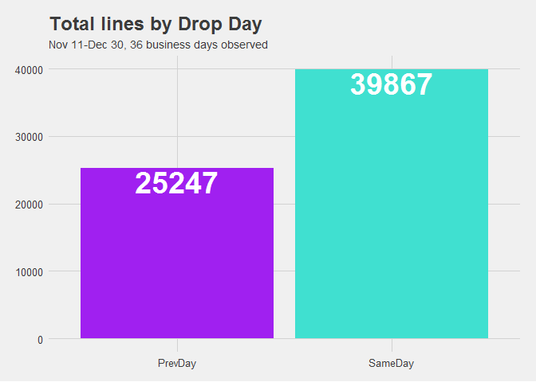<!-- -->

Here we can clearly see in the 36 business days observed that significant portion of the lines dropped for shipment were dropped on the same day they were due to ship. Of the 65114 lines due for shipment in that time frame, 39867 were dropped the day they were due to ship. Over this time frame, approx. 61.2% of our work was dropping the same day it was due to ship, equating to a 16.2% shift in visibility. I will discuss further how the *time* in which the lines dropped shifted, that has even more of an impact than this swing.

To ensure that those aggregated numbers aren't heavily influenced by a few days,we can break out the data over time to see how each day behaves.

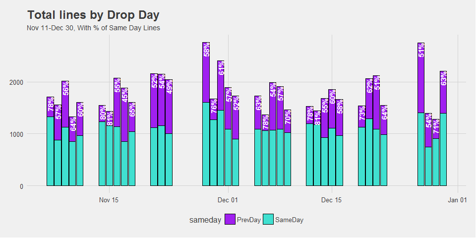<!-- -->

By making each day show as a filled bar, we can quickly observe how each day looks as a percentage of same day vs previous day drops, and quickly determine that the trend holds of now having significantly more lines dropped same day. To double check the perception of fill, I added a % notation. In the chart, only 2 days had previous day drops of more lines than same day drops.


Now I will begin to explore hourly drops on the same day level, to understand the impact of changes made.Here, I've plotted drops occuring after 8am, which is when we typically start seeing orders entered same day, over time. We can clearly see a trend of larger line amounts being dropped later in the day. 


This bubble/heatmap is probably my favorite visualization of the changes in drops. The black lines represent the drop changes as noted earlier, and the change in drops is visibly shifting up and right as the changes occur. Updated versions of this plot will appear later as additional data is added. 

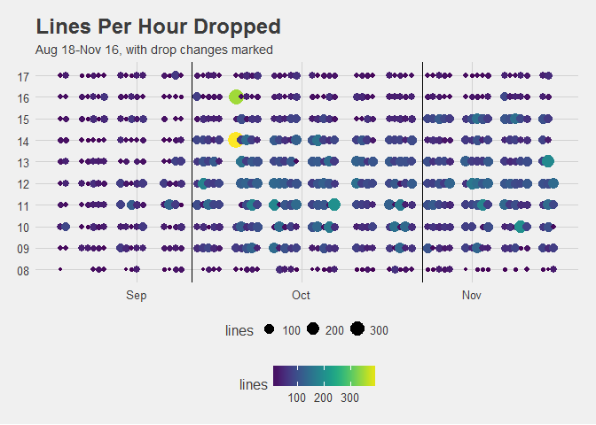<!-- -->

Now that we have seen the interaction over time, we can try to explore trends at a weekly level. Do days of the week behave differently? We will explore this by breaking down into 2 timeframes: 1pm cutoff & 3pm cutoff.

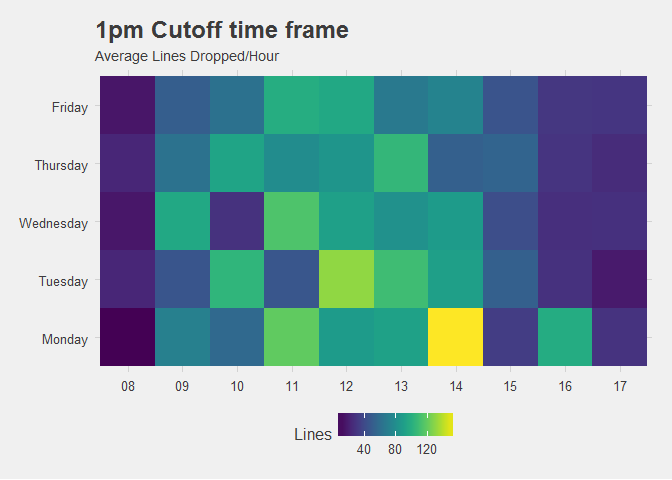<!-- -->

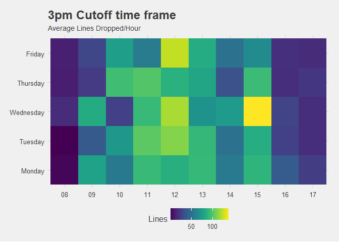<!-- -->


Now we can explore the change in hourly drops a little more in detail, in relation to how we can expect each hour to behave. By understanding hourly behavior, we can begin to plan labor needs. Averages can be a bit misleading due to outliers skewing the mean. Additionally, understanding variance is important. an hour where we have an average of 50 lines, with a standard deviation of 10, is easy to plan for. An hour where we have an average of 50 lines, with a standard deviation of 50, is very hard to plan for. Along with the standard boxplot, I have included a black dot to indicate the mean, with bars to indicate standard error. These combined give insight to the amount of variance per each hourly drop. The larger the variance, the harder to plan.


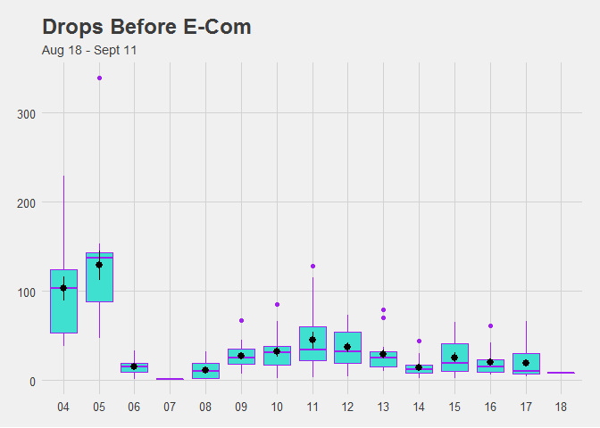<!-- -->
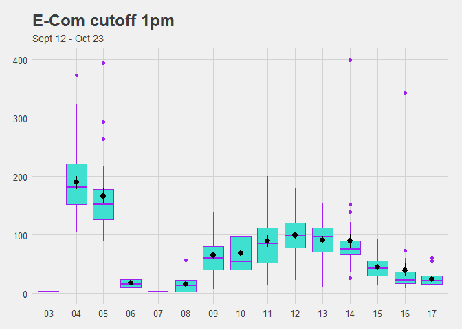<!-- -->
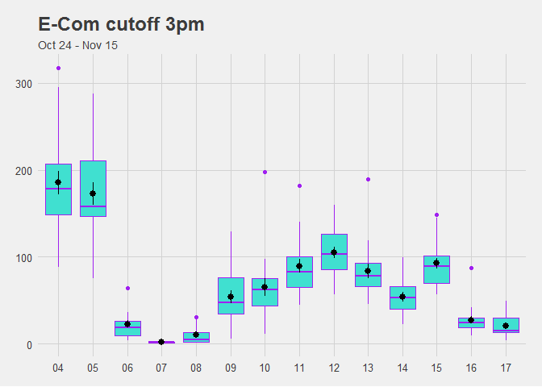<!-- -->

As you can see, both changes to the cutoff time made a significant impact to other drops. The behavior I'm most concerned with is the change from 1pm to 3pm, where we see a clear shift in lines dropped at the 1pm hour, suggesting that we could be seeing a change in *behavior* from individuals entering orders. We also see a decrease in early morning drops, which could be a result of orders that would traditionally sit in the cue for release in the morning drops being entered for same day shipment. These plots in conjunction with the same day vs previous day graphs earlier depict a serious change in business flow, which could implicate added labor costs. When less work is available early in the day, labor will be more inefficient. As drops move closer to shipment cutoff, which is currently 7pm, potential issues present a greater threat to impact on time shipping.


Taking numbers from Tim's previously mentioned Same Day analysis, I noticed a discrepancy in total lines per day listed as saemday lines. Plotted below for comparison, after further digging, it is primarily due to his analysis filtering out air shipments. For my analysis, I have kept these in, since they have a significant impact on total lines. 
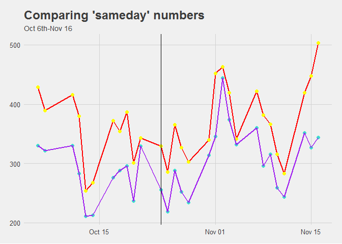<!-- -->

Just looking at my data, we see some interesting trends over that time.


```
##        group1 n     mean       sd median min max range        skew
## X11    Friday 6 321.1667 44.91065  322.0 268 389   121  0.21795145
## X12    Monday 5 376.4000 43.25853  372.0 329 422    93  0.04278569
## X13  Thursday 6 341.0000 69.01884  321.5 254 429   175  0.21045195
## X14   Tuesday 6 389.6667 63.33930  399.0 286 452   166 -0.45974821
## X15 Wednesday 6 410.6667 58.04366  383.5 365 503   138  0.60006382
```


##Drop Composition

An analysis of drop composition originally completed on data provided from October 6th through November 15th did not provide actionable insight. Nonetheless, here are my high level findings. I am not including time based breakdowns or relationships between customers and parts, since no significant relationship was found.

### By Customer

A large number of customers had orders placed that were deemed to be same day orders. 2773 unique addresses were identified, accounting for 6082 orders. The top 2 customers combined account for 406 orders(6.68% of same day orders). Most things follow an 80-20 rule, which in this case would imply 80% of orders should be accounted for by looking at the top 20% of customers. That does not apply. The top 20% would translate to the top 555  customers, but at that point, all customers have ordered 2 orders. The line from 3 orders to 2 orders is at the 426th customer. For that reason, I decided not to focus on customers for my analysis, since it would be an insignificant driver. Side note, in the summary, one thing I find particularly interesting that I didn't explicitly investigate was average sameday order drop time.It shows that the average hour that the orders drop is approximately the 1pm bucket, skewed towards 2pm. That's strictly based off the hour within which the order was dropped, and affected by the length of time the data is scattered accross. I would expect to see that central point move over the different time frames. We also see the average lines per order being 1.75, seemingly skewed by higher number orders, since the median (likely a more reliable central measure in this instance) is 1. As expected, more total sameday lines drop on Wednesday than any other day (Mondays are slightly skewed due to holidays), having a total of 2467 lines .

###By Part


```
##        PRTNUM         ORDQTY               DOW          DropTime    
##  MHPC10025: 285   Min.   :  1.000   Monday   :1870   Min.   : 5.00  
##  QTUM0TEX1: 180   1st Qu.:  1.000   Tuesday  :2285   1st Qu.:11.00  
##  SCGPU05RE: 157   Median :  1.000   Wednesday:2398   Median :13.00  
##  MPGP04001: 156   Mean   :  2.963   Thursday :1993   Mean   :12.65  
##  CDUFBI001: 151   3rd Qu.:  2.000   Friday   :1855   3rd Qu.:14.00  
##  (Other)  :9470   Max.   :283.000                    Max.   :17.00  
##  NA's     :   2   NA's   :2
```


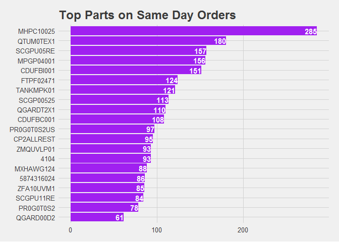<!-- -->

Looking at the top 20 parts, we see a lot of "consumables" for kits. This isn't too surprising and lines up pretty well with normal volumes. In a normal 60 day time frame, we ship ~6800 unique SKUs. In this sameday analysis, we see 1885 unique SKUs, with the top 20 accounting for 2365  lines out of 10401 lines 22.7%, which is much better than our customer percentage. 
This information could provide actionable insight to use for slotting purposes, but as many as 3-4 lots of a part can be actively picked at any time, creating a major barrier to slotting. Without *Red Prairie* FEFO logic controlling lots and allocating 1 location at a time until picked completely clean, this information is not easily leveraged.

To get an idea of parts driving afternoon orders specifically, we can subset based on the hour they were dropped.

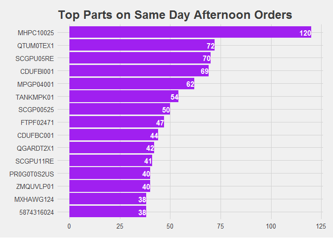<!-- -->

Not surprisingly, there's not too much of a change, the percentage only changes marginally to 22.8%.


##Adding Data from 11-15 to 1-09

After being provided additional Data, comparing total lines from 2016-10-06 to 2017-01-09.

Would need data from 2016-09-12 through 2016-10-24 to clarify further. 

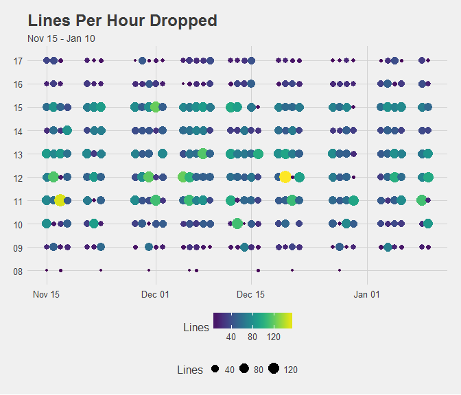<!-- -->
 
 There does seem to be a growth in number of same day lines after the 3pm drop change, despite dips in overall volume. Without pulling additional data, this can be verified by looking at daily shipped line averages for October, November, and December. Those are as follows: 2074,2159,1987, respectively. Given the sharp fall off in daily volume for December, it would be expected that the trendline(blue) would show a noticeable dip in December, but it does not.Furthermore, the linear regression line shoes a noticeable increase despite impact of very low outliers around New Years.
 
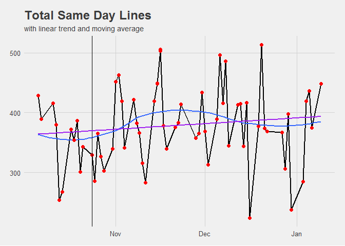<!-- -->


##Lines 'Just Missed'

To begin looking at what to expect with changes to the drops, we can begin by looking at orders booked between 3-4pm and 4-5pm that were not released or requested to ship that day. It appears that about 516 orders during this time show booked date= release date = request date, but not all have RUSH as priority. These have been removed and assumed to have been additional same day orders, dropped as express shipments.

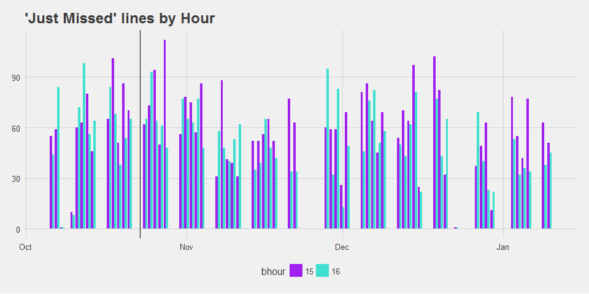<!-- -->

It appears that lines 'Just Missed' hasn't significantly shifted with the change from 1pm to 3pm, but it's hard to tell if this is an actual effect or not. It seems to be impacted significantly by noise related to monthly/quarterly behavior. This would suggest that the trend is somewhat stable over time, when looking in terms of weeks, or even months, but the variance is high, making it very hard to plan. this is confirmed by looking at total 'just missed' lines as well.

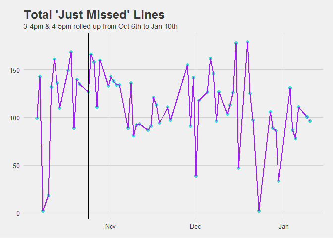<!-- -->

If we dive into the effect that the change from 1pm to 3pm had, we see a clear drop off in 'Just Missed' lines from the 2pm hour, but interestingly, it seemed to have little impact to the 1pm hour. The data for 'Just Missed' from October 6- October 23 doesn't give use much more clarity, due to such a small sample size. To have a better understanding, older data, preferably as far back as mid August, would be needed.

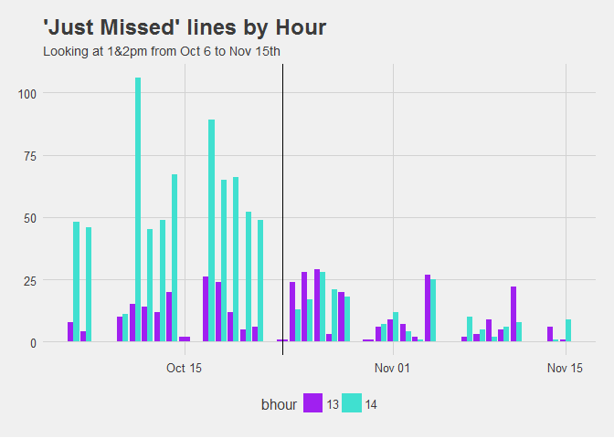<!-- -->

One problem we encounter here is that there was no 1 hour step back, so we aren't entirely sure what the impact will be. However, I think it's important to note that there is not a complete lack of 2pm orders listed as 'just missed' and I believe the 1pm drops show similar behavior. It appears we should expect approximately 19% of orders to go on back order. This is problematic for projecting drops as it can result in a wide range of outcomes.


Exploring hourly behavior further, and displaying variance.


```
##     group1  n  mean       sd median max range
## X11     15 64 59.50 23.36393     60 112   111
## X12     16 64 52.75 21.94510     52  98    97
```

Extracting only days since the change to 3pm drops.

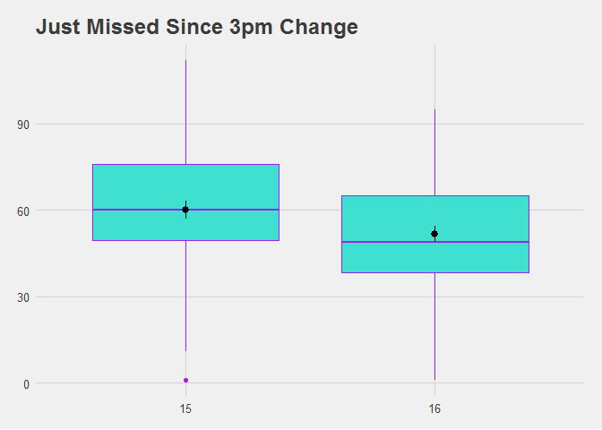<!-- -->

We can see that the distribution of 'just missed' lines in the 3-4pm block is higher on average than the 4-5pm block, suggesting that the 'just missed' lines and possible future same day lines taper towards the end of the day.

Finally, looking at the effect of weekday on 'just missed' since the change to 3pm


```
##        group1  n     mean       sd median min max range
## X11    Monday 10 121.3000 29.25767  119.0  87 179    92
## X12   Tuesday 12 121.4167 26.66103  119.0  91 166    75
## X13 Wednesday 10 118.5000 27.97320  123.5  81 158    77
## X14  Thursday  9 103.0000 38.61671   96.0  39 178   139
## X15    Friday 10  91.9000 49.73362  102.5   2 160   158
```
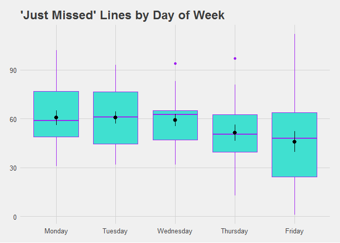<!-- -->

Interestingly, this shows a pattern consistent with what I would expect over the course of week given our inbound patterns. Our busiest inbound day is Monday, which coorelates to the above graph having a higher overall grouping than the rest of the week. Fridays tend to be slower, so not surprising that it not only has more variance, but that the variance is on the low side. Since businesses and employees tend to take it easy on Friday, it makes sense that Friday would display lower activity. Wednesday has an interesting tight upper grouping, suggesting little variance once above the median, but that it's very common to  be a larger drop. That trend shows more variation when broken hour by which hour.

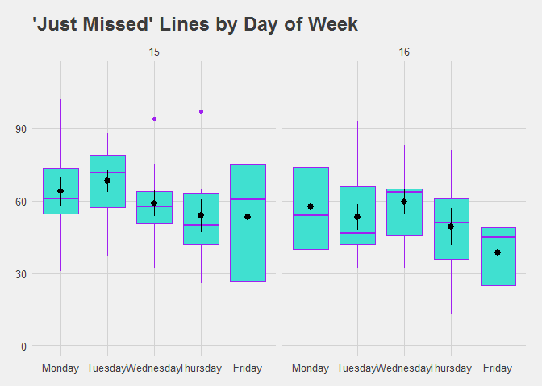<!-- -->

It appears much of the variation on Friday occurs in the 3-4pm timeframe, and drops off significantly in the 4-5pm time frme, which is what we expect.Wednesday is the largest point of concern however, since the mean/median drops are larger for the 4pm just missed group than the 3pm just missed group.

**note:explore lag effect/auto correlation, explore day of the week (x)/hour(y)/lines(size) distribution, analyze data since 4pm change**

#Projecting Future Changes Based on 'Just Missed'

Building a random forest model to predict drops produced on average ~21 RMSE, meaning when the model was cross validated, it was off on average by about 21 lines, in either direction. The R squared was approximately .49, so the model could explain 49% of the variance using Day of the Week, Drop Time, and Previous Drop, which isn't ideal. However, multiple models consistently valued Drop Time as the most important variable, with Previous Drop coming in 2nd, and Day of Week last. This is not consistent with expectation, so I believe additional feature engineering needs to be done to get an accurate forecast. The main goal of using a random forest model at this point is to find what variables correlate strongest with drops.

# Concerns 
Going forward into a change to 4pm cutoff with goal of transitioning to 5pm cuttoff, I have concerns about how CSR behavior impacts order patterns as noted in the change from 1pm to 3pm.
Additionally, there doesn't seem to be enough data before October 6th to draw conclusions about what impact there truly is by moving drops times, and there's absolutely no reference point for moving back only 1 hour. The variance and uncertainty we see in the changes certainly make it clear it will be nearly impossible to predict, making it very hard to plan labor. This will result in the need to overstaff, driving up labor costs significantly. As well, the noted change in previous day drops to same day drops shows that we could have issues where there simply isn't enough work for 1st shift to operate efficiently, then 2nd shift getting hit with disproportionate volumes. With some days having  150+ 'just missed' lines, there are also some conerns about absolute process capabilities, which need to be investigated.


This is an [R Markdown](http://rmarkdown.rstudio.com) Notebook. 
